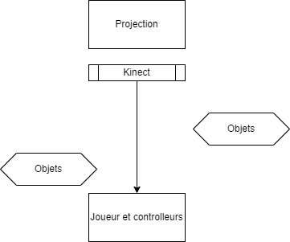
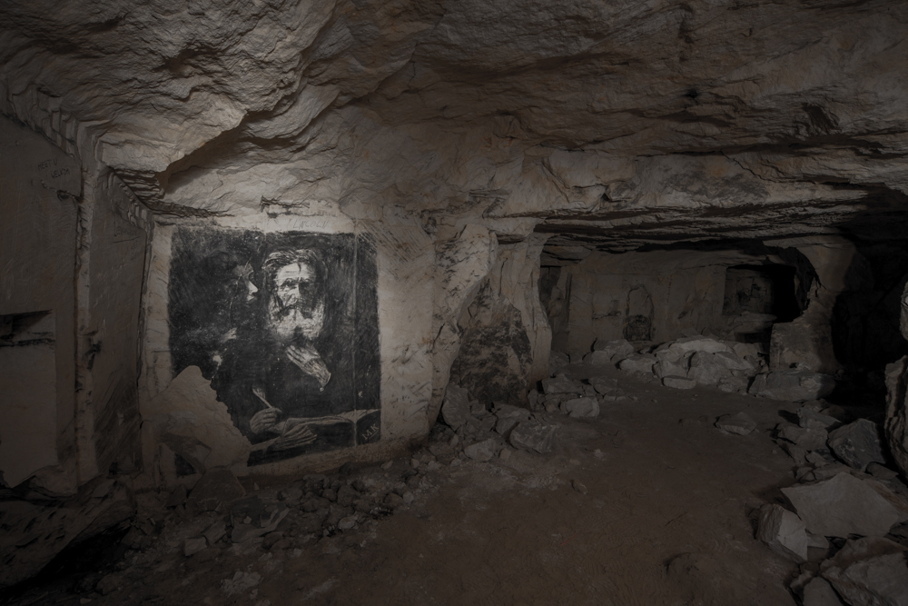
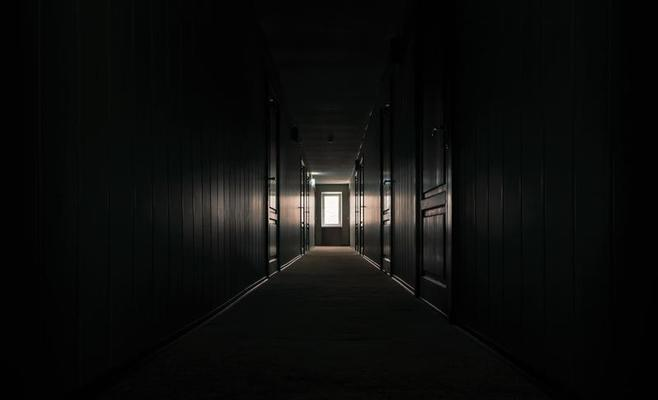

# Gestion_de_projet

Le but du jeu est de créer de l'interactivité entre le monde réel et le monde virtuel.
 
 
Le jeu comportera une projection vidéo, des éléments électroniques et un ou des contrôleurs.
 
 
L'installation ferait l'utilisation d'objets réels, de création d'univers 3d et de l'utilisation de la kinect.
 
La projection serait créée en 3 dimensions et serait exporté en segments vidéo de quelques secondes. 
 
Lorsque le joueur atteint un obstacle, la vidéo s’arrêtera et ne continuera pas tant que l’obstacle ne sera pas résolu.
 
Si le joueur résolue le problème/énigme, la prochaine vidéo se mettra en marche. 
 
Chaque énigme sera résolue de manière différente. Certaines devront être résolu de manière électronique (un ou des objets électroniques qui communiquent avec la vidéo), certaines avec la Kinect (oblige le joueur à se déplacer, à se baisser etc.) et d’autres avec les contrôleurs.
Il serait nécessaire de créer trois ou quatre autres interractivité pour que le jeu ait une durée respectable et soit appréciable.

Exemple de Projet : 
Le jeu se déroulerait dans un environnement sombre tel une grotte ou un endroit où l'on nécessite quelques outils.
Par exemple, si l'on entre dans une grotte sombre, pour avoir de la lumière dans le monde virtuel, il faudrait allumer une lumière dans le monde réel, et ainsi de suite.

     
  

